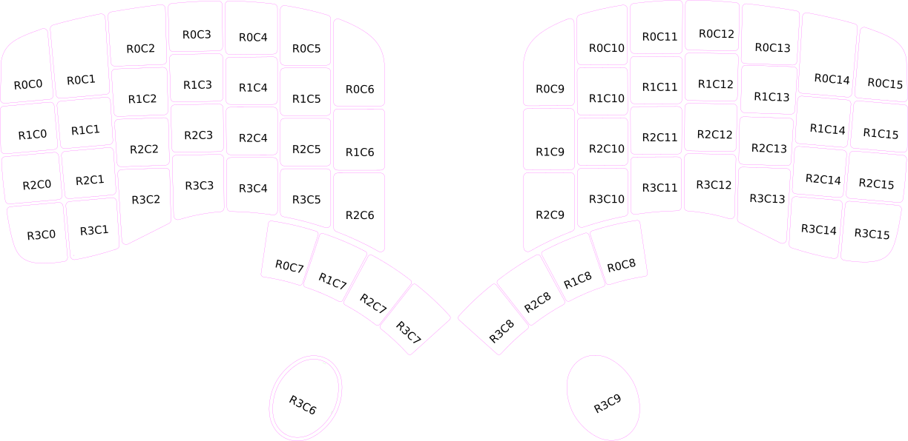

# MagicCombo

The `MagicCombo` extension provides a way to perform custom actions when a
particular set of keys are held down together. The functionality assigned to
these keys are not changed, and the custom action triggers as long as all keys
within the set are pressed. The order in which they were pressed do not matter.

This can be used to tie complex actions to key chords.

## Using the extension

To use the extension, we must include the header, create actions for the magic
combos we want to trigger, and set up a mapping:

```c++
#include <Kaleidoscope.h>
#include <Kaleidoscope-Macros.h>
#include <Kaleidoscope-MagicCombo.h>

enum { KIND_OF_MAGIC };

void kindOfMagic(uint8_t combo_index) {
  Macros.type(PSTR("It's a kind of magic!"));
}

USE_MAGIC_COMBOS(
[KIND_OF_MAGIC] = {
  .action = kindOfMagic,
  .keys = {R3C6, R3C9} // Left Fn + Right Fn
});

KALEIDOSCOPE_INIT_PLUGINS(MagicCombo, Macros);

void setup() {
  Kaleidoscope.setup();
}
```

It is recommended to use the `RxCy` macros of the core firmware to set the keys
that are part of a combination.

## Plugin properties

The extension provides a `MagicCombo` singleton object, with the following
property:

### `.min_interval`

> Restrict the magic action to fire at most once every `min_interval`
> milliseconds.
>
> Defaults to 500.

## Plugin callbacks

Whenever a combination is found to be held, the plugin will trigger the
specified action, which is just a regular method with a single `uint8_t`
argument: the index of the magic combo. This function will be called repeatedly
(every `min_interval` milliseconds) while the combination is held.

## Further reading

Starting from the [example][plugin:example] is the recommended way of getting
started with the plugin.

`RxCy` coordinates for a Model01:



 [plugin:example]: /examples/Keystrokes/MagicCombo/MagicCombo.ino
